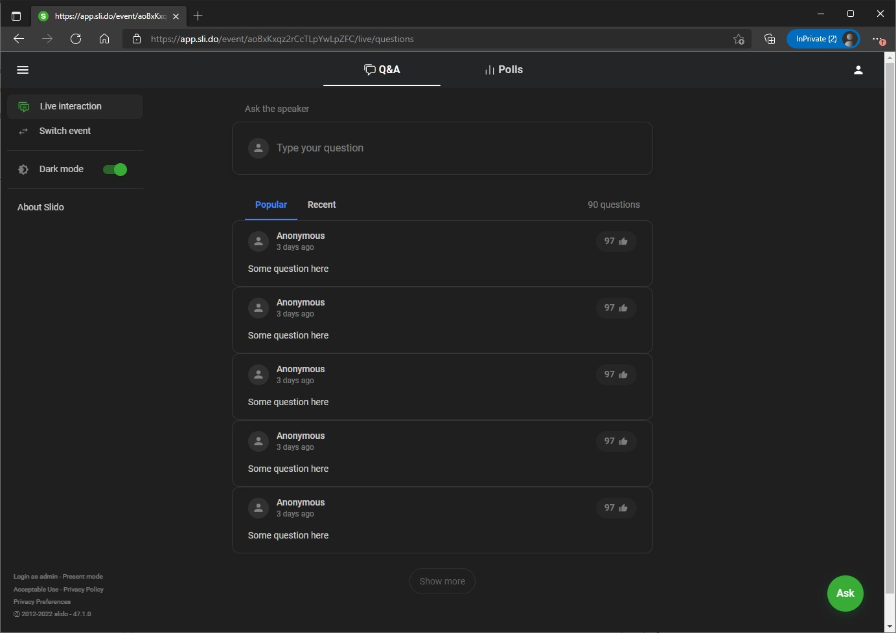
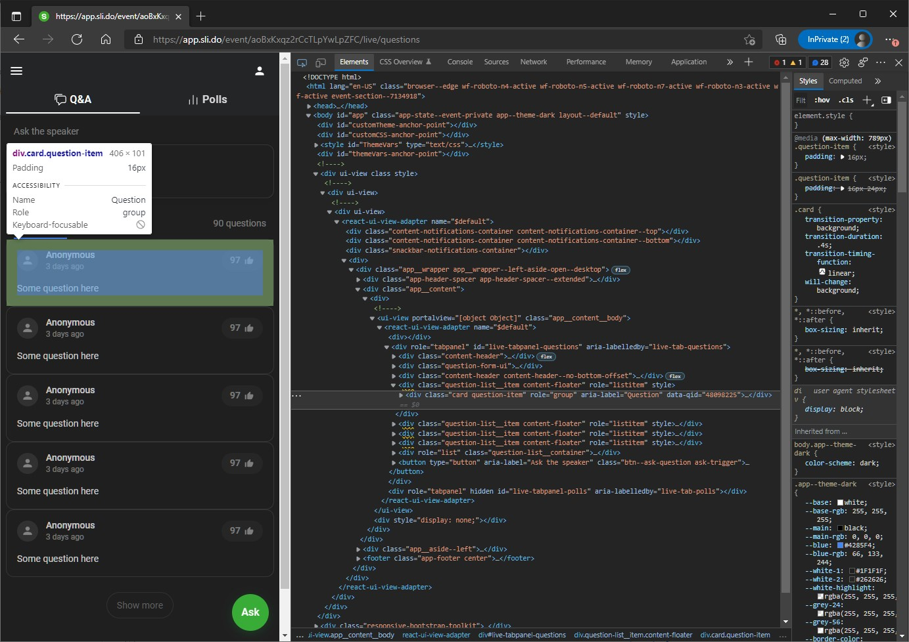
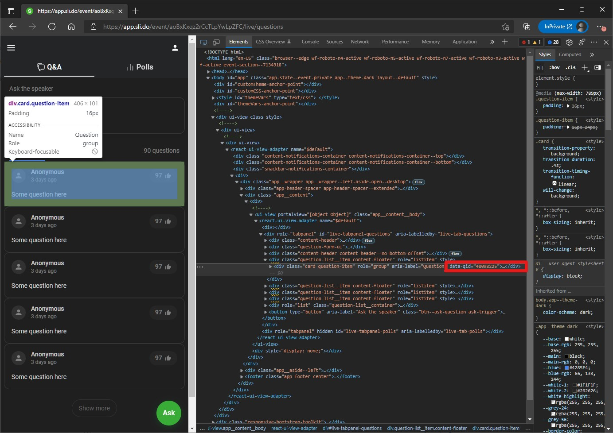

# Slido Vote Me

A simple vote bot for the audience interaction tool Slido (sli.do) made in Python.

## Installation

Clone the project:
```bash
git clone https://github.com/DavidLHW/slido-me-first.git
```

Install dependencies:
```shell
python -m pip install -r requirements.txt
```
    
This project runs on Python version >= 3.7.6.

## Usage
To use the bot, you need the following:
*   Url to the Slido event
*   Question id
*   Number of vote to add

### Running the bot

Simply copy the following to a terminal:

```
python vote.py -u <url> -q <data-qid> -v <number of vote>
```

### Getting the required data
1.  Url to the Slido event

    This will be the same url that is sent to you by the presenter.

2.  Question id

    You'll need to access the slido page and inspect the page element to get the question id.

    Hit `F12` to bring up inspect element and click on select element.
    
      

    
    Click on your question with the selector tool.

    

    Copy the value for `data-qid` from the element (it is `48098225` in this case).

    
    

<br>

Have fun watching your questions get noticed!
